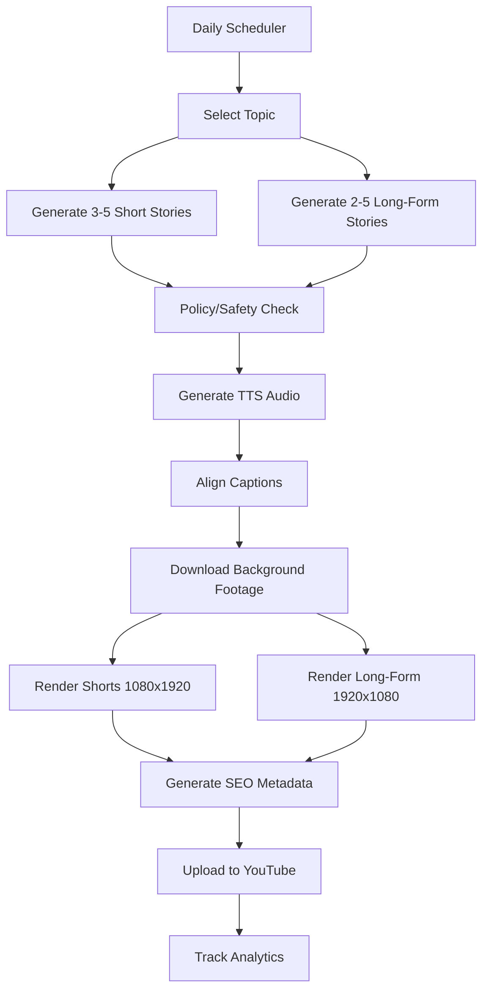

# StoryFactory

> Local **desktop app** for fully automated, **multi-channel** YouTube content generation — original fictional Reddit-style stories

StoryFactory ships as an Electron application on your machine (`apps/desktop`). The dashboard and Python worker run locally; nothing is deployed to the cloud.

StoryFactory runs any number of **channels** — each an independent content operation with its own niche, content rules, prompt/voice customization, integrations, and YouTube account — all sharing one pipeline. Per channel it generates **1 long-form video** and **3–5 YouTube Shorts** per day, each featuring original fictional stories inspired by popular Reddit-style formats (AITA, relationships, revenge, etc.).

> **New to multi-channel?** See [docs/multi-channel.md](docs/multi-channel.md). Existing single-channel installs migrate automatically to a "default" channel — just run `npm run db:migrate`. **Scope:** local desktop only — [docs/project-scope.md](docs/project-scope.md).

> **Important**: All stories are original fiction. We do not scrape Reddit. We do not copy real posts. Every video description includes a configurable disclosure: *"These are original fictional stories created for entertainment."*

---

## Cloud pipelines

- **Sleep On Facts** now runs in GitHub Actions, not the desktop app: `cloud/sleep-on-facts/` (daily ~3-hour narrated image-slideshow video, uploaded automatically). See its README; the desktop `sleep_facts` mode is legacy and the channel is paused in the app.

## Architecture

```
storyfactory/
├── apps/
│   ├── desktop/      # Electron app (target product — bundles dashboard + worker)
│   ├── dashboard/    # Next.js UI (embedded in desktop, dev via npm run dev)
│   └── worker/       # Python – FFmpeg rendering, TTS, captions, uploads
├── packages/
│   └── shared/       # Shared TypeScript types and Zod schemas
├── docs/             # Documentation
├── .env.example
└── package.json      # Root scripts (dashboard, worker, tests)
```

## Quick Start

### Prerequisites

- **Node.js** ≥ 18
- **Python** ≥ 3.11
- **FFmpeg** (install from https://ffmpeg.org)
- **API Keys** (see below)

### 1. Clone & Install

```bash
git clone <repo-url>
cd storyfactory

# Install Node dependencies (dashboard + shared)
npm install

# Install Python dependencies (worker)
cd apps/worker
pip install -r requirements.txt
cd ../..
```

### 2. Configure Environment

```bash
cp .env.example .env
# Edit .env with your API keys
```

**Required API keys:**
| Key | Where to get it | Required? |
|-----|----------------|-----------|
| `OPENAI_API_KEY` | https://platform.openai.com/api-keys | Yes |
| `GEMINI_API_KEY` | https://aistudio.google.com/apikey | Optional (free tier; needed for `cast init`) |
| `YOUTUBE_CLIENT_ID` | Google Cloud Console | For uploads |
| `YOUTUBE_CLIENT_SECRET` | Google Cloud Console | For uploads |
| `PEXELS_API_KEY` | https://www.pexels.com/api/ | Recommended |
| `PIXABAY_API_KEY` | https://pixabay.com/api/docs/ | Optional |

### 3. Initialize Database

```bash
npm run db:migrate
npm run seed
```

### 4. Run locally (development)

**Dashboard only** (browser):

```bash
npm run dev
# http://localhost:3000
```

**Desktop app** (Electron + dashboard + worker integration):

```bash
cd apps/desktop
npm install
npm run dev
```

### 5. Run Worker (Dry Run)

```bash
npm run worker:daily -- --dry-run
```

This tests the full pipeline without API calls or YouTube uploads.

### 6. Run Worker (Production)

```bash
# Full daily pipeline
npm run worker:daily

# Individual steps
npm run worker:render
npm run worker:upload
npm run worker:analytics
```

---

## CLI Commands

| Command | Description |
|---------|-------------|
| `npm run dev` | Start dashboard dev server |
| `npm run build` | Build dashboard for production |
| `npm run worker:dev` | Start worker in dev mode |
| `npm run worker:daily` | Run full daily content pipeline |
| `npm run worker:render` | Process the render queue |
| `npm run worker:upload` | Upload rendered videos to YouTube |
| `npm run worker:analytics` | Fetch YouTube analytics |
| `npm run db:migrate` | Run database migrations (creates/upgrades the default channel) |
| `npm run seed` | Seed database with defaults |
| `npm run worker:channel` | Manage channels (create/list/set-secret/connect/etc.) |
| `npm run worker -- cast ...` | Cast library: character clip bank for fiction Shorts (`init`, `prompts`, `scan`, `status`, `config`) — see docs/multi-channel.md |
| `npm run test` | Run all tests |

Worker commands invoke Python internally but are exposed as npm scripts for consistency.

### Multi-channel flags

Most worker commands accept a channel target:

```bash
npm run worker:daily -- --channel <slug|id>   # one channel
npm run worker:daily -- --all-active          # every active channel, sequentially
npm run worker:full  -- --all-active          # generate + upload for all active channels
```

See [docs/multi-channel.md](docs/multi-channel.md) for the full channel CLI and the dashboard **Channels** page.

---

## Desktop application

The end goal is a **packaged local app** (Windows installer via Electron Builder), not a hosted deployment.

| Mode | Command |
|------|---------|
| Dev — desktop shell | `cd apps/desktop && npm run dev` |
| Dev — dashboard only | `npm run dev` |
| Build installer | `cd apps/desktop && npm run build:dashboard && npm run package` |

The desktop scheduler runs `worker:full --all-active` daily for every active channel. Multi-channel setup: [docs/multi-channel.md](docs/multi-channel.md). Full desktop guide: [docs/desktop-app.md](docs/desktop-app.md). Worker/FFmpeg details: [docs/worker-setup.md](docs/worker-setup.md).

---

## YouTube API Setup

1. Create a project in [Google Cloud Console](https://console.cloud.google.com)
2. Enable the YouTube Data API v3
3. Create OAuth 2.0 credentials
4. Complete the OAuth consent screen
5. Generate a refresh token

> **Audit Limitation**: New YouTube API projects are limited to private uploads until your app passes a Google audit. See [docs/youtube-oauth-setup.md](docs/youtube-oauth-setup.md) for full instructions.

---

## Content Pipeline



---

## Safety & Compliance

StoryFactory includes multiple safety layers:

- **Local keyword screening** - instant blocking of harmful content
- **AI-powered policy review** - nuanced content analysis
- **Automated rewriting** - fixes minor violations while preserving stories
- **Asset license verification** - only uses verified-free assets
- **Anti-spam guardrails** - prevents duplicate/low-quality content
- **YouTube compliance** - `madeForKids=false`, synthetic media disclosure, privacy fallback

---

## Testing

```bash
# All tests
npm run test

# Worker tests only
npm run test:worker

# Dashboard tests only
npm run test:dashboard
```

---

## Configuration

Configuration splits cleanly into two places:

1. **Settings → Integrations (shared, app-level).** Provider API keys used by every
   channel — OpenAI, Gemini, Pexels, Pixabay, shared TTS, storage — are entered
   **once** here (or seeded from `.env` on first run) and stored encrypted in the
   database. You do not repeat them per channel.
2. **Channels → [channel] (per-channel).** Each channel connects its own **YouTube**
   account and configures its **content profile** (what it produces) plus niche,
   style, quotas, and prompt overrides.

Anything a channel does not override inherits the app-level default.

### Content profiles (per-channel outputs)

Each channel composes exactly what it generates — there is no fixed template:

| Channel goal | Settings |
|--------------|----------|
| Shorts-only (e.g. 1/day) | Generate Shorts ✓, long-form ✗, shorts/day min=max=1 |
| Long-form only (e.g. "sleep facts") | Shorts ✗, long-form ✓, niche/prompt override for calm facts |
| Classic mix (default) | Shorts ✓ (3–5/day) + one long-form compilation ✓ |

A channel must produce at least one output. Set these in the dashboard
(**Channels → Content**) or via the `ENABLE_SHORTS` / `ENABLE_LONG_FORM` env
defaults (see [`.env.example`](.env.example)).

### App-level keys

- `STORYFACTORY_SECRET_KEY` – master key that encrypts stored secrets at rest (generate with `npm run worker:channel -- generate-key`)
- `YOUTUBE_CLIENT_ID` / `YOUTUBE_CLIENT_SECRET` – shared Google Cloud OAuth app (each channel connects its own account)
- `OPENAI_API_KEY` / `GEMINI_API_KEY` / `PEXELS_API_KEY` / `PIXABAY_API_KEY` – seed the shared Integrations on first run; manage them afterward under **Settings → Integrations**
- `DRY_RUN=true` – Test pipeline without API calls
- `AUTO_MODE=true` – Enable fully automated mode
- `FAIL_SAFE_ON_POLICY_FLAG=true` – Block flagged content (default; overridable per channel)
- `UPLOAD_PRIVACY_MODE=public` – Default upload visibility (overridable per channel)

Manage shared keys without the UI:

```bash
echo '{"api_key":"sk-..."}' | npm run worker -- settings set-secret --provider text.openai --enable --secrets-stdin
npm run worker -- settings status
```

> **Security:** shared and per-channel secrets are stored encrypted in the
> database and are never exposed to the client, written to `.env`, or logged.
> Dashboard secret writes are sent to the worker over stdin, never on the command line.

---

## License

MIT
